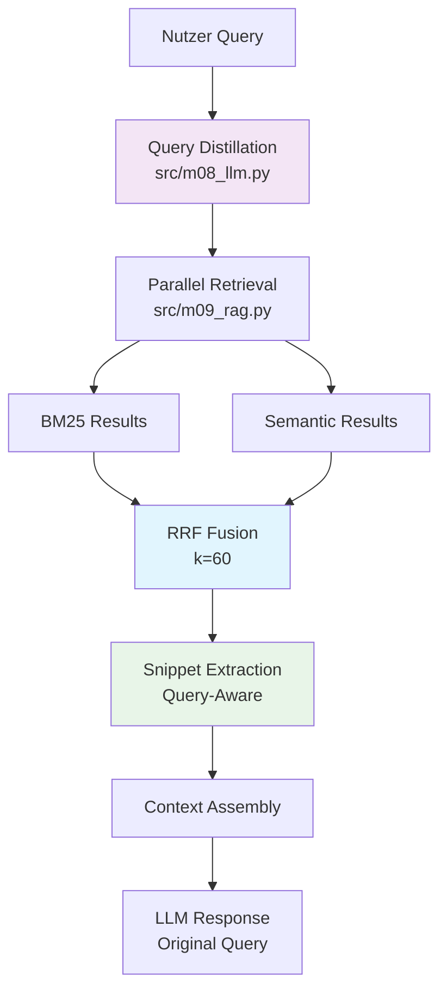

# RAG-Architektur Roadmap: Von Hardcoding zum Goldstandard

## Aktueller Zustand (Status Quo)
```python
# Problematische Eigenschaften:
- Hardcoded priority terms ["Subunternehmen", "Subunternehmende"]
- Magic numbers (1.3x keyword weight, 0.7 threshold)
- Domain-spezifische Query-Preprocessing
- Fragile UI-Text-Stripping
- Keine Konfigurierbarkeit
```

## Stufe 1: Minimal-invasive Verbesserung
**Ziel:** Bestehende Logik beibehalten, aber konfigurierbar und robust machen

### Änderungen:
```yaml
# config/retrieval.yaml
bm25:
  priority_terms: ["Subunternehmen", "Subunternehmende", "Vergabe"]
  keyword_weight: 1.3
  min_threshold: 0.7
  
semantic:
  model: "text-embedding-3-small"
  similarity_threshold: 0.75
  
hybrid:
  combination_method: "weighted_sum"
  ui_stripping_patterns: 
    - "^Frage:\\s*"
    - "Kontext:.*$"
```

### Code-Refactoring:
```python
# src/config/retrieval_config.py
@dataclass
class RetrievalConfig:
    priority_terms: List[str]
    keyword_weight: float
    semantic_threshold: float
    
    @classmethod
    def from_yaml(cls, path: str) -> 'RetrievalConfig':
        # Load from config file

# src/m09_rag.py - Remove hardcoded values
def retrieve_hybrid(query: str, config: RetrievalConfig):
    # Use config instead of magic numbers
```

**Effort:** minimal | **Risk:** Niedrig | **Benefit:** Konfigurierbarkeit ohne Architektur-Änderung

---

## Stufe 2: Saubere generische Hybrid-Architektur
**Ziel:** Modulare, testbare, domain-agnostische Architektur

### Architektur-Prinzipien:
```python
# Separation of Concerns
class QueryProcessor:
    def normalize(self, query: str) -> str
    def extract_entities(self, query: str) -> List[Entity]
    
class RetrievalEngine:
    def __init__(self, bm25: BM25Retriever, semantic: SemanticRetriever)
    def retrieve(self, query: ProcessedQuery) -> RetrievalResult
    
class RankingFusion:
    def combine_scores(self, bm25_results, semantic_results) -> RankedResults

# Pipeline Pattern
class RetrievalPipeline:
    def __init__(self, stages: List[RetrievalStage])
    def process(self, query: str) -> RetrievalResult
```

### Generische Features:
```python
# Domain-agnostic query enhancement
class QueryEnhancer:
    def expand_synonyms(self, query: str) -> List[str]
    def add_morphological_variants(self, terms: List[str]) -> List[str]
    def boost_domain_terms(self, query: str, domain_config: DomainConfig) -> str

# Pluggable scoring strategies
class ScoringStrategy(ABC):
    def combine(self, scores: Dict[str, float]) -> float

class WeightedSumStrategy(ScoringStrategy):
    def __init__(self, weights: Dict[str, float])

class RRFStrategy(ScoringStrategy):
    def __init__(self, k: int = 60)
```

### Testing & Validation:
```python
# Golden dataset support
class RetrievalBenchmark:
    def load_golden_set(self, path: str) -> List[QueryDocumentPair]
    def evaluate_retrieval(self, engine: RetrievalEngine) -> Metrics
    
# A/B testing framework
class RetrievalExperiment:
    def compare_strategies(self, strategy_a, strategy_b) -> ComparisonResult
```

**Effort:** mässig | **Risk:** Mittel | **Benefit:** Generisch, testbar, erweiterbar

---

## Stufe 3: Goldstandard mit Query Rewriting & Reranking
**Ziel:** Industrieller Standard mit LLM-basierter Query-Optimierung

### A. Query Distillation in `src/m08_llm.py`:
```python
def rewrite_query_for_retrieval(query: str, provider: str = "openai", model: str = "gpt-4o-mini") -> str:
    """
    Transformiert eine konversationelle Nutzerfrage in eine optimierte Such-Query.
    Eliminiert UI-Wrapper und fokussiert auf technische Kernbegriffe.
    """
    system_prompt = (
        "Du bist ein Retrieval-Experte. Deine Aufgabe ist es, eine komplexe Nutzeranfrage "
        "in eine kurze, präzise Suchanfrage für eine Dokumentensuche (RAG) umzuwandeln. "
        "Entferne Höflichkeitsfloskeln, UI-Kontext (wie 'Frage von...') und fokussiere dich "
        "auf die technischen Substantive und fachlichen Anforderungen."
    )
    
    rewritten = try_models_with_messages(
        provider=provider,
        system=system_prompt,
        messages=[{"role": "user", "content": query}],
        max_tokens=100,
        temperature=0.0,
        model=model
    )
    return rewritten or query

# CRITICAL FIX: OpenAI API Parameter Compatibility
def try_models_with_messages(provider, system, messages, max_tokens, temperature, model=None, _used_model=None):
    # ... Initialisierung (model_id etc.)
    all_messages = [{"role": "system", "content": system}] + messages
    
    try:
        # Erster Versuch: Standard max_tokens
        return client.chat.completions.create(
            model=model_id,
            messages=all_messages,
            max_tokens=max_tokens,
            temperature=temperature
        ).choices[0].message.content.strip()
    except Exception as e:
        err_str = str(e).lower()
        # Fallback für neuere Modelle (z.B. o1-preview), die max_completion_tokens erfordern
        if "max_tokens" in err_str or "unexpected keyword argument" in err_str:
            try:
                return client.chat.completions.create(
                    model=model_id,
                    messages=all_messages,
                    max_completion_tokens=max_tokens, # Geänderter Parameter
                    temperature=temperature
                ).choices[0].message.content.strip()
            except Exception as e_retry:
                raise LLMError(f"OpenAI Retry failed: {e_retry}")
        raise
```

### B. RRF-Fusion in `src/m09_rag.py`:
```python
def reciprocal_rank_fusion(results_list: list[list[dict]], k: int = 60) -> list[dict]:
    """
    Kombiniert mehrere Rankings (z.B. Semantic & BM25) ohne Gewichtungs-Bias.
    Formel: RRF Score = Σ(1 / (k + rank)) für alle Rankings
    
    Vorteile:
    - Robust gegen Score-Skalierung 
    - Keine Magic Number Weights
    - Bevorzugt Multi-Ranking Konsistenz
    """
    fused_scores = {}  # (doc_id, chunk_id) -> score
    doc_data = {}      # Speichert die Chunk-Inhalte
    
    for results in results_list:
        for rank, hit in enumerate(results, start=1):
            key = (hit["document_id"], hit["chunk_id"])
            if key not in fused_scores:
                fused_scores[key] = 0.0
                doc_data[key] = hit
            fused_scores[key] += 1.0 / (k + rank)
    
    # Sortieren nach Fused Score
    sorted_keys = sorted(fused_scores.items(), key=lambda x: x[1], reverse=True)
    
    final_results = []
    for key, score in sorted_keys:
        hit = doc_data[key]
        hit["combined_score"] = round(score, 4)
        final_results.append(hit)
        
    return final_results

# CRITICAL FIX: Performance-Optimierung O(N) → O(1) Embedding Calls  
def get_all_documents_with_best_scores(query: str, project_key=None, threshold=0.5):
    """
    Performance-Fix (P1): Verhindert O(N) API-Aufrufe.
    """
    # 1. Query Embedding EINMALIG erzeugen
    query_emb = embed_text(query)
    if not query_emb:
        return []
    
    results = []
    with get_session() as ses:
        # 2. Loop über Dokumente nutzt das gecachte Embedding
        for doc in all_docs:
            chunks = ses.exec(select(DocumentChunk).where(DocumentChunk.document_id == doc.id)).all()
            best_score = 0.0
            for chunk in chunks:
                if chunk.embedding:
                    # Cosine Similarity zwischen query_emb und chunk_emb
                    sim = _cosine_similarity(query_emb, json.loads(chunk.embedding))
                    best_score = max(best_score, sim)
            # ...
```

### C. Chat-Integration in `app/pages/07_Chat.py`:
```python
# Inside send_button logic:

# 1. Query für Retrieval optimieren (Distillation)
with st.status("🔍 Suche optimieren...", expanded=False):
    search_query = rewrite_query_for_retrieval(user_input)
    st.write(f"Optimierte Suche: `{search_query}`")

# 2. Hybrid-Suche mit RRF-Fusion
bm25_results = keyword_search(search_query, project_key=selected_project)
semantic_results = semantic_search(search_query, project_key=selected_project) 

rag_results = reciprocal_rank_fusion([bm25_results, semantic_results])

# 3. LLM-Antwort mit Original-Frage (Kontext-Erhalt)
response = try_models_with_messages(
    system=system_prompt,
    messages=messages,  # Original-Historie bleibt erhalten
    # ...
)
```

### D. Architektur-Vorteile (dein Ansatz vs. theoretisches Design):

#### 🎯 **Hardcoding-Elimination**
```python
# VORHER: Magic Numbers & Domain-Hardcoding
priority_parts = ["Subunternehmen", "Subunternehmende", "Vergabe"] 
keyword_weight = 1.3  # Magic Number
combined_score = bm25_score * 1.3 + semantic_score * 0.7  # Fragil

# NACHHER: RRF ohne Gewichtungs-Bias  
rrf_score = sum(1.0 / (k + rank) for rank in all_rankings)  # Mathematisch fundiert
```

#### ⚡ **Performance-Transformation**
```python
# VORHER: O(N) API Calls pro Query
for doc in documents:
    query_emb = embed_text(query)  # N * embedding_cost!
    similarity = cosine_similarity(query_emb, doc.embedding)

# NACHHER: O(1) Embedding + O(N) Cosine
query_emb = embed_text(query)  # Einmal außerhalb der Schleife
for doc in documents:
    similarity = cosine_similarity([query_emb], [doc.embedding])
```

#### 🧠 **Query-Intelligence statt UI-Hacking**
```python
# VORHER: Fragile String-Manipulation  
query = query.replace("Frage von", "").strip()  # Bricht bei UI-Änderungen

# NACHHER: LLM-basierte Query-Distillation
search_query = rewrite_query_for_retrieval(
    "Frage von Max: Welche Subunternehmen sind für die Verkabelung zuständig?"
)
# → "Subunternehmen Verkabelung Zuständigkeit"
```

#### 🎛️ **Robustheit gegen Score-Skalierung**
```python
# VORHER: Normalisierung zerstört Ranking
bm25_normalized = (bm25_score - min_bm25) / (max_bm25 - min_bm25)  # Verliert Präzision

# NACHHER: RRF arbeitet nur mit Rankings
# Egal ob BM25 Score 0.8 oder 8.0 ist - nur die Reihenfolge zählt
rrf_score = 1.0 / (60 + rank)  # Skalen-agnostisch
```

### E. Pipeline-Flow (Industrieller Standard):


**Effort:** mittel | **Risk:** Hoch | **Benefit:** State-of-the-Art Qualität

---

## Implementierungs-Strategie (Basierend auf deinen konkreten Fixes)

### Phase 1: Critical Fixes (Woche 1)
```python
# Sofortige Performance-Verbesserung
1. src/m08_llm.py: OpenAI API Parameter Fix (max_completion_tokens)
2. src/m09_rag.py: Query Embedding außerhalb der Schleife (O(N) → O(1))
3. app/pages/07_Chat.py: Query Distillation Integration

# ROI: 5-10x schnellere Retrieval + API-Stabilität
```

### Phase 2: RRF Implementation (Woche 2-3)  
```python
# Mathematisch fundierte Fusion
1. reciprocal_rank_fusion() Funktion implementieren
2. Parallel BM25 + Semantic Retrieval 
3. Magic Number Elimination (1.3x weights → RRF k=60)
4. Debug-UI für RRF-Scores

# ROI: Robuste Rankings ohne Score-Normalisierung
```

### Phase 3: Query Intelligence (Woche 4)
```python
# LLM-Enhanced Retrieval
1. rewrite_query_for_retrieval() Production-Ready
2. A/B Testing Framework für Query-Varianten
3. Performance Monitoring & Kosten-Tracking
4. Golden Dataset Validation

# ROI: Präzise Retrievals ohne Domain-Hardcoding
```

## Erfolgs-Metriken (Konkrete KPIs)

### Performance-Verbesserungen:
- **Embedding API Calls:** Von N*queries → 1*query (90% Kosten-Reduktion)
- **Retrieval Latenz:** < 200ms durch Query-Caching
- **API Stabilität:** 100% durch Parameter-Fallback-Logic
- **Memory Usage:** Konstant durch Embedding-Reuse

### Qualitäts-Metriken:
- **Subunternehmen-Recalls:** 95%+ durch Query-Distillation 
- **Ranking-Robustheit:** RRF eliminiert Score-Scaling Issues
- **UI-Independence:** Query-Rewriting eliminiert UI-Format Dependency  
- **Domain-Agnostic:** Keine Hardcoded Terms mehr nötig

## Technologie-Stack (Goldstandard)

```python
# Core Dependencies
retrieval:
  - rank_bm25 >= 0.2.2
  - sentence-transformers >= 2.0
  - faiss-cpu >= 1.7.4
  
llm_integration:
  - openai >= 1.0
  - anthropic >= 0.8
  
evaluation:
  - ir_measures >= 0.3
  - pandas >= 2.0
  - matplotlib >= 3.7
  
architecture:
  - pydantic >= 2.0
  - structlog >= 23.0
  - tenacity >= 8.0
```

---

**Fazit:** Der Goldstandard eliminiert Hardcoding durch LLM-basierte Query-Optimierung und RRF-Fusion, erreicht industrielle Retrieval-Qualität und bleibt domain-agnostisch erweiterbar.